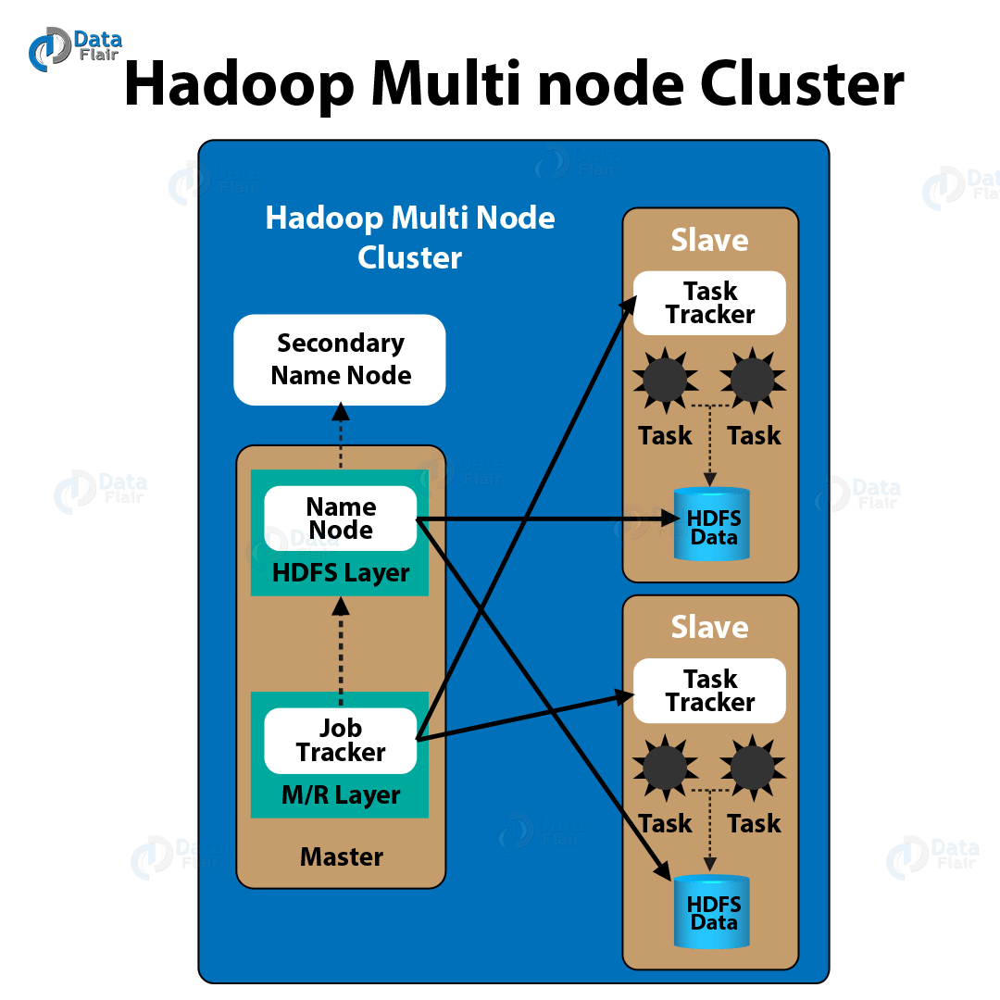

### NameNode

- The **NameNode** executes file system namespace operations like opening, closing, and renaming files and directories.It also determines the mapping of blocks to DataNodes.

### DataNodes

- The **DataNodes** are responsible for serving read and write requests from the file system’s clients. The DataNodes also perform block creation, deletion, and replication upon instruction from the NameNode.
- The DataNode stores HDFS data in files in its local file system.The DataNode has no knowledge about HDFS files. It stores each block of HDFS data in a separate file in its local file system.

### File

- a file is split into one or more blocks and these blocks are stored in a set of DataNodes. 

- all blocks in a file except the last block are the same size.

- Files in HDFS are write-once and have strictly one writer at any time.

### The Persistence of File System Metadata

- The NameNode uses a transaction log called the **EditLog** to persistently record every change that occurs to file system metadata.
- The entire file system namespace, including the mapping of blocks to files and file system properties, is stored in a file called the **FsImage**. The FsImage is stored as a file in the NameNode’s local file system too.

---

**Blockreport**: DataNode scans through its local file system, generates a list of all HDFS data blocks that correspond to each of these local files and sends this report to the NameNode

### 源码

2.7.3源码

- 编译问题

```
问题：Failed to parse plugin descriptor for org.apache.hadoop:hadoop-maven-plugins

解决：cd到hadoop-maven-plugins，执行mvn clean 然后 install 一下，再执行编译通过
```

# 端口

# HDFS

##     DataNode


     50010  dfs.datanode.address   datanode服务端口，用于数据传输
    50075  dfs.datanode.http.address  http服务的端口
    50475  dfs.datanode.https.address  https服务的端口
    50020  dfs.datanode.ipc.address   ipc服务的端口

##     NameNode


​     50070  dfs.namenode.http-address  http服务的端口 （**访问hadoop的管理页面**）
​    50470  dfs.namenode.https-address  https服务的端口
​    8020   fs.defaultFS   接收Client连接的RPC端口，用于获取文件系统metadata信息。

##     journalnode


     8485   dfs.journalnode.rpc-address   RPC服务
     8480   dfs.journalnode.http-address   HTTP服务

##     ZKFC


     8019   dfs.ha.zkfc.port   ZooKeeper FailoverController，用于NN HA

## YARN

##     ResourceManager


     8032  yarn.resourcemanager.address   RM的applications manager(ASM)端口
    8030  yarn.resourcemanager.scheduler.address  scheduler组件的IPC端口
    8031  yarn.resourcemanager.resource-tracker.address  IPC
    8033  yarn.resourcemanager.admin.address  IPC
    8088  yarn.resourcemanager.webapp.address   http服务端口（**访问yarn的管理页面**）

##     NodeManager


​     8040  yarn.nodemanager.localizer.address  localizer IPC
​    8042  yarn.nodemanager.webapp.address   http服务端口（**从节点node管理界面，可查看节点的任务处理信息**）
​    8041  yarn.nodemanager.address   NM中container manager的端口

##     JobHistory Server


     10020   mapreduce.jobhistory.address   IPC
    19888   mapreduce.jobhistory.webapp.address   http服务端口

#  HBase


   Master
     60000   hbase.master.port  IPC
     60010   hbase.master.info.port  http服务端口
   RegionServer
     60020   hbase.regionserver.port   IPC
     60030   hbase.regionserver.info.port   http服务端口
   HQuorumPeer
     2181  hbase.zookeeper.property.clientPort   HBase-managed ZK mode，使用独立的ZooKeeper集群则不会启用该端口。
     2888  hbase.zookeeper.peerport   HBase-managed ZK mode，使用独立的ZooKeeper集群则不会启用该端口。
     3888  hbase.zookeeper.leaderport  HBase-managed ZK mode，使用独立的ZooKeeper集群则不会启用该端口。

#  Hive


   Metastore
     9083  /etc/default/hive-metastore中export PORT=<port>来更新默认端口   
   HiveServer
     10000   /etc/hive/conf/hive-env.sh中export HIVE_SERVER2_THRIFT_PORT=<port>来更新默认端口   

#  ZooKeeper


   Server
     2181  /etc/zookeeper/conf/zoo.cfg中clientPort=<port>  对客户端提供服务的端口
     2888  /etc/zookeeper/conf/zoo.cfg中server.x=[hostname]:nnnnn[:nnnnn]，标蓝部分  follower用来连接到leader，只在leader上监听该端口。
     3888  /etc/zookeeper/conf/zoo.cfg中server.x=[hostname]:nnnnn[:nnnnn]，标蓝部分  用于leader选举的。只在electionAlg是1,2或3(默认)时需要。
