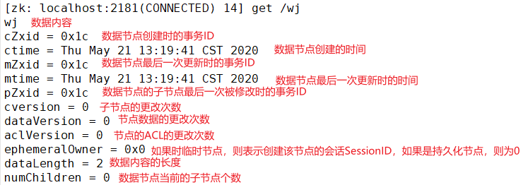
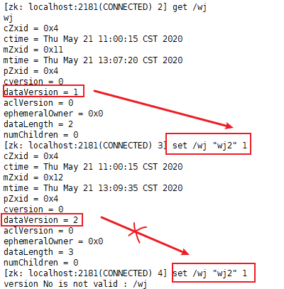

## 参数配置

- tickTime

Length of a single tick, in milliseconds. ZooKeeper uses tick as the basic time unit to regulate timeouts. Default is 2000.

- initLimit

Number of ticks after which the ZooKeeper server times out during the synchronization process. Default is 10.

- syncLimit

Maximum number of ticks for the followers to wait to synchronize with the leader before the followers time out. Default is 5.

- dataDir

Absolute path for the ZooKeeper to store the in-memory snapshots of the data and the transactional log of updates to the database.

- clientPort

Port on which the ZooKeeper server listens for client connections.

- maxClientCnxns

Maximum number of concurrent connections that a single client can make to a single member of the ZooKeeper ensemble. Default is 10.

## 终端操作

### 新増节点

```
create [-s] [-e] path data #其中-s 为有序节点，-e临时节点。不写 -s/-e 默认为创建持久化节点
```

### 查看节点

```
get path
```



- 查看节点状态
  
  ```
  stat path  #返回结果和get命令类似，但不会返回节点数据内容。
  ```

### 修改节点

```
set path data [dataVersion]
```

可以用set命令修改节点数据。也可以基于版本号进行修改，当传入的dataVersion与当前版本号不一致时，zookeeper会拒绝修改。



### 返回节点列表

```
ls   path
ls2  path
```

### 删除节点

```
delete path [dataVersion]
```

 与更新节点类似，删除也可以传入版本号，当传入的dataVersion与当前版本号不一致时，zookeeper会拒绝删除。

- 要想删除某个节点及其后代节点，可以使用递归删除
  
  ```
  rmr path
  ```